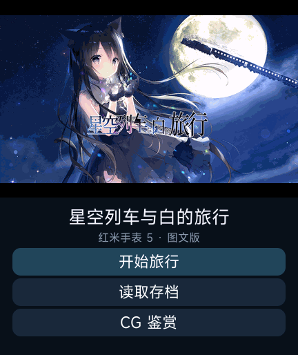

# 星空列车与白的旅行 · REDMI Watch 5

《星空列车与白的旅行》的 Xiaomi Vela 手表阅读版本。将 Windows 版剧情与图像转换为手表资源，提供对白阅读、角色立绘、剧情选择、存档与 CG 鉴赏，界面按 REDMI Watch 5 的 432 × 514 屏幕设计。

本项目参考 **[@liuyuze61](https://github.com/liuyuze61)** 的《ATRI 1.5.1》与《星空列车与白的旅行 v1.0.0》移植作品，完成了本项目的资源转换和播放器功能扩展。两部参考作品的原始链接见「参考作品与致谢」。

> 资料截至 2026-10-09。当前版本 **0.2.5**，应用名称为“星空列车与白的旅行”。已完成 REDMI Watch 5 上机测试，图标正常显示，目前各项功能暂未发现异常。程序代码采用 MIT 许可证，原游戏资源不在代码许可范围内。

## 功能与本项目成果

- **人物与场景显示**：对白、角色立绘、背景与 CG 配合呈现，按手表屏幕缩放资源。
- **剧情分支**：17 章、13,765 条对白/旁白、10 条选项文本，保留 4 组选项及对应分支。
- **30 个存档栏位**：保存和加载均可自行选槽，覆盖前确认；支持从标题加载和旧版单槽存档兼容。
- **下一章放入游戏菜单**：阅读时直接跳章，同时支持上一句、下一句、逐字/即时显示与字号切换。
- **分组 CG 鉴赏**：标题直接进入，124 张 CG 按场景整理为 24 组。同场景差分只占一个列表项，打开后点击画面切换下一张，支持前后组切换及返回原列表页。
- **资源读取与内存处理**：只缓存正在阅读的一章，限制历史记录；当前兼容包使用 PNG 图像和内容为 JSON 的 UTF-8 TXT 剧情资源。
- **图标与名称修复**：用角色封面替换应用列表的单色占位图标，图标为 192 × 192 PNG；应用名使用完整游戏名称。

CG 鉴赏中的转换资源全部开放，可能提前展示后续剧情。

## 开发工具与分工

本项目的程序实现、资源转换、图像处理、手表界面适配、测试工具及文档整理由 **OpenAI Codex** 在维护者的需求与反馈指导下完成。维护者负责提出需求、提供原版资源、审查成果及完成 REDMI Watch 5 实机测试。

## 画面预览

| 标题界面 | 剧情阅读 |
| --- | --- |
|  |  |

截图来自官方 Vela 原生模拟器。标题为 0.2.5，剧情截图为 0.2.4；当前版的游戏代码与剧情图像资源与 0.2.4 相同。

## 当前安装包

[下载当前版本及校验文件](https://github.com/xuanyide01/starry-rw5/releases/tag/v0.2.5)。

| 项目 | 内容 |
| --- | --- |
| 应用名称 | 星空列车与白的旅行 |
| 版本 | 0.2.5 / versionCode 8 |
| 包名 | `com.codex.starry.rw5` |
| BIN 文件 | `starry-rw5-v0.2.5.bin` |
| 文件大小 | **9,987,269 字节，约 9.99 MB** |
| 包内文件解压总大小 | 11,604,228 字节，不含安装工具额外开销 |

MB 按 1,000,000 字节计算。BIN 与同版本 RPK 内容相同，任选安装工具支持的格式。当前产物使用开发签名。

```text
SHA256
1536b9f1142c9f76bbdd41ec45e3ad6fcefd6e288ac0411ae1a5122ff3bbfb07
```

## 安装与使用

1. 使用支持 REDMI Watch 5 的 Vela 应用安装工具安装对应 BIN；已有实机测试使用「表盘自定义工具」（相关社区：[米坛社区 BandBBS](https://www.bandbbs.cn/)）。
2. **工具显示安装完成后，仍需等待一阵，手表端才会完成安装。** 等待应用与图标在列表中正常显示，再打开游戏；不要刚看到完成提示就反复重装。
3. 在应用列表打开“星空列车与白的旅行”，选择开始、加载或 CG 鉴赏。
4. 阅读时打开菜单，选择保存、加载或下一章。保存时选定栏位；加载时自行选择所需栏位。
5. CG 列表选择场景，打开后点击图片循环切换差分。

包名和存档键保持不变。覆盖安装是否保留数据取决于安装工具，卸载可能清除存档；更新前请保留旧安装文件并记录版本。

## 适配与验证

目标设备为 **REDMI Watch 5**，已有测试设备信息为 M2427W1、系统 3.100.105。**小米手环 8 Pro 尚未适配。**

- 12 项自动测试通过，包含资源引用、36 种选项组合路径、存档、菜单跳章、CG 与 TXT 读取/错误恢复检查。
- 0.2.4 在官方原生模拟器中通过 17 章逐一读取、全部 6 页 CG 列表、代表场景差分循环及旧存档加载检查。
- 0.2.5 通过原生模拟器安装、启动、应用名称与图标资源检查；游戏代码和剧情图像资源与 0.2.4 逐字节相同，已有模拟器存档数据库未发生变化。
- **0.2.5 已完成 REDMI Watch 5 上机测试，应用图标正常显示，目前各项功能暂未发现异常。** 此项依据维护者于 2026-10-09 提供的实机反馈记录。

原生环境使用官方 `vela-watch-5.0` 镜像，并非实机系统 3.100.105 的完整复刻。实机与模拟器检查的范围以已测试设备和已检查内容为准，尚未覆盖所有设备、固件及长期运行情况。

## 开发与构建

在 Windows 的项目根目录执行，需 Node.js 与 npm，并已准备好 `src/common/` 下的转换资源：

```powershell
npm ci
npm install --prefix tools/compat-toolkit --ignore-scripts
npm test
npm run build
```

产物为 `dist/com.codex.starry.rw5.debug.0.2.5.rpk`。构建固定使用 **aiot-toolkit 1.1.0**，`tools/compat-toolkit` 将图片依赖 sharp 固定为 0.34.5；项目根目录的 2.0.5 依赖用于开发和模拟器工具。构建脚本检查 **25,000,000 字节**上限。

```text
src/                  Vela 应用、界面与转换后的运行资源
tools/                原版资源提取、转换、构建和模拟器工具
tests/                自动测试
native-test-results/  带实际版本号的原生检查记录
docs/images/          README 截图
```

若仓库只公开程序代码和工具，需先准备原版资源的转换结果，再构建。`extract-original.py`、`export-images.py` 针对本次 Unity/Utage 资源版本；目前并非任意 Galgame 的一键转换器。旧 `compress-images.py` 属于 0.2.2 的 JPEG 方案，当前兼容包不要运行它覆盖 PNG 资源。

### 原生模拟器

```powershell
$env:STARRY_EMULATOR_HOME = Join-Path $env:LOCALAPPDATA 'VelaGalgameDev'
npm run emulator:setup
npm run emulator
```

两个项目共用 `STARRY_EMULATOR_HOME` 指定的 SDK 与虚拟设备目录。首次准备会联网下载官方 SDK 镜像，并在用户目录 `.vela/vvd/` 注册 432 × 514 的虚拟设备。

待虚拟系统完成启动后，另开终端进入本项目目录，安装已经构建的包：

```powershell
$rpkPath = (Resolve-Path 'dist/com.codex.starry.rw5.debug.0.2.5.rpk').Path
$installUrl = 'http://127.0.0.1:43125/install?rpk=' + [Uri]::EscapeDataString($rpkPath)
Invoke-RestMethod -Uri $installUrl
Invoke-RestMethod -Uri 'http://127.0.0.1:43125/start'
```

随后在浏览器打开 `http://127.0.0.1:43125/` 操作虚拟手表。停止应用与关闭虚拟设备可分别使用本地控制接口 `/stop`、`/shutdown`；关机时 HTTP 连接可能随进程退出而关闭，应检查虚拟进程已结束。

两个项目的控制器使用相同端口和虚拟设备名称，不要同时运行；切换游戏时先关闭前一个控制器并冷启动虚拟设备。部分原生测试脚本会写入测试存档，执行前备份自己的模拟器数据。官方模拟器用于开发验证；已测实机情况见上方，其他设备和固件需另行验证。

## 已知限制与异常处理

当前不含原版音乐、配音、视频、复杂动画及完整多人立绘站位。Windows 原版引擎没有在手表上运行，图像经过缩放和压缩。

应用无响应但系统仍能操作时，退出后重新打开并加载最近手动存档。整个手表无响应时，按[小米官方电源键说明](https://www.mi.com/global/support/faq/details/KA-524524/)长按约 **18 秒**，出现标志后松开。黑屏无法启动时，参考[官方 FAQ](https://www.mi.com/uk/support/faq/details/KA-521474/)使用原配充电座充电至少 10 分钟，再尝试强制重启；仍无法恢复则联系售后。

本应用只声明 `system.storage`、`system.file`、`system.prompt`，不包含固件或系统分区写入代码。包体限制和现有检查不能保证所有设备零崩溃。反馈问题时请提供设备型号、系统版本、应用版本、章节及复现步骤。

## 参考作品与致谢

感谢 **[@liuyuze61](https://github.com/liuyuze61)** 的手表移植作品，它们为应用结构、剧情资源组织及兼容性研究提供了参考：

- **ATRI 1.5.1**，作者 @liuyuze61：[原作品分享链接](https://api.bandbbs.cn/wftools/bandbbs.html?code=A&state=1820673)。
- **星空列车与白的旅行 v1.0.0**，作者 @liuyuze61：[原作品分享链接](https://api.bandbbs.cn/wftools/bandbbs.html?code=A&state=1841662)。
- 作者相关开源项目：[ATRI-miband](https://github.com/liuyuze61/ATRI-miband)。
- 平台开发资料：[Xiaomi Vela JS 应用官方文档](https://iot.mi.com/vela/quickapp/)。

表盘分享链接保留原分享地址，需要浏览器或「表盘自定义工具」访问。也感谢原作开发者、译者、开源工具作者及参与实机反馈的测试者。

感谢 **「表盘自定义工具」的开发者及相关团队**提供安装工具，支持本项目的应用安装与实机测试。相关社区：[米坛社区 BandBBS](https://www.bandbbs.cn/)。

## 原作官网

《星空列车与白的旅行》：[しらたまこ官方网站](https://shiratamaco.com/)。

## 许可证与游戏资源

本项目自行编写的程序代码采用 [MIT 许可证](LICENSE)。第三方代码保留原许可证和署名；参考项目许可见 [ATRI-miband-LICENSE](licenses/ATRI-miband-LICENSE)。

原版剧本、立绘、CG、背景和标识属于相应权利人，不纳入本项目代码许可证。含有这些素材的完整安装包也不能仅凭代码的开源许可获得素材分发授权。MIT 许可只覆盖程序代码，原作素材的使用和分发仍受相应权利人的授权约束。请支持原作。

## 相关项目

[夏日口袋 · REDMI Watch 5](https://github.com/xuanyide01/summer-rw5)。
